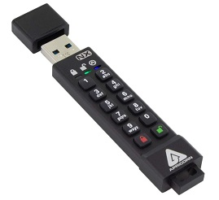
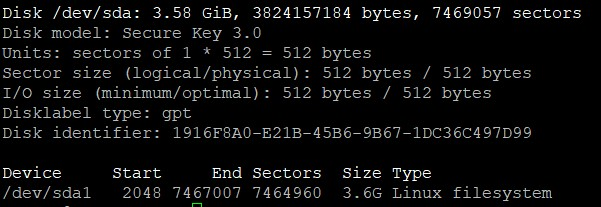

# Instructions for using an Apricorn Aegis Secure Key with Rocket Pool

This guide explains how to configure a Rocket Pool node to store its node wallet, password file, and validator signing keys on an Aegis Secure Key (model 3N or 3NX).  This provides an added layer of security for the home server node operator by placing these files on an AES 256 encrypted USB drive that requires a PIN key to unlock.  The key will be configured so that it will remain unlocked when connected to the server during normal operations, reboots, and powered shutdowns.  When combined with a UPS that will issue commanded shutdowns upon a mains power failer, it will remain unlocked so long as standby power is provided to the server by the UPS. 

A PIN will be required whenever the USB key is disconnected from the server or if the server is unplugged from mains power.  The PIN prevents access to the wallet and the eth2.0 validator signing keys in the event of theft of the server.  Even if the thief plugs in the server designed to autoboot upon power restoration the server will not be able to submit attestations on the installed validators.  This will procide assuance to the node operator that they can reinstall and recover their seeds without fear of having two signing keys triggering a slashing event. Also the node wallet and password file will be inaccessible to the thief without the knowledge of the Aegis Secure Key PIN. 

## Hardware required


Apricorn Aegis Secure Key Model 3NX (4 GB) purchased on Amazon for $53 USD. Note: Any capacity drive will do as you will be storing only a few kilobytes worth of information.  You can order either a USB 3.0 connector (3NX) or a USB C connector (3NXC). The USB drive slot must remain powered during a shutdown. Yellow (they look orange to me) colored USB-A ports, and most USB C continue to provide power when the server is turned off. For my use case, I used a 3NX connected to a rear-facing USB C (Thunderbolt) slot on my server via and USB-A to USB-C dongle.


## Installation instructions

### Configure the Secure Key

1. Setup an Admin password on the Secure Key following the *First-Time Use* instruction found in the [Aegis User Mannual](https://apricorn.com/content/product_pdf/aegis_secure_key/usb_3.0_flash_drive/ask3_manual_configurable_online_2.pdf) on page 5 
1. Enable *Lock-Override Mode* (see page 20 of the manual). This enables the key to remain unlocked during reboots and powered shutdowns.
1. Unlock the Aegis Key by entering the Admin PIN and plug it into the server within 30 seconds.

<br>

### Format the Secure Key


1. Find the device name: 
    ```
    sudo fdisk -l
    ```
    The Disk model will be titled *Secure Key 3.0*. Note the Device name assigned to the drive. In the example below, it is `/dev/sda1`.

1. Choose the GPT partitioning standard: 
    ```
    sudo parted /dev/sda mklabel gpt
    ```
1. Once the format is selected, you can create a partition spanning the entire drive by typing: 
    ```
    sudo parted -a opt /dev/sda mkpart primary ext4 0% 100%
    ```
1. Now that we have a partition available, we can format it as an Ext4 filesystem. To do this, pass the partition to the mkfs.ext4 utility: 
    ```
    sudo mkfs.ext4 /dev/sda1
    ```
    > Note: Make sure you pass in the partition and not the entire disk. In Linux, disks have names like `sda`, `sdb`, `hda`, etc. The partitions on these disks have a number appended to the end. So we would want to use something like `sda1` and not `sda`.


 
 <br>
 
 ### Mount the Secure Key

1. Create a /key subdirectory under the default ~/.rocketpool directory to mount the Secure Key
    ```
    sudo mkdir ~/.rocketpool/key
    ```
1. Edit the /etc/fstab file (`sudo nano /etc/fstab`) to mount the filesystem automatically each time the server boots by adding the following to the bottom of the /etc/fstab file and save. Replace USERNAME with your the username where the /.rocketpool directory was installed.
    ```
   /dev/sda1 home/USERNAME/.rocketpool/key ext4 defaults 0 2
    ```
1. Mount the filesystem now by typing:
    ```
    sudo mount -a
    ```

<br>

### Configure Rocket Pool

1. Stop the Rocket Pool service:
    ```
    rocketpool service stop
    ```
1. Move the data folder into the key mount:
    ```
    sudo mv ~/.rocketpool/data ~/.rocketpool/key/
    ```

1. Edit the config.yml file (`sudo nano ~/.rocketpool/config.yml`) and edit the location of `passwordPath`, `walletPath`, and `vallidatorKeychainPath` by inserting `/key` to the following entries:
    ```
    passwordPath: /.rocketpool/key/data/password
    walletPath: /.rocketpool/key/data/wallet
    validatorKeychainPath: /.rocketpool/key/data/validators
    ````
1. Start the Rocket Pool service:
    ```
    rocketpool service start
    ```
1. Verify that the installation was successful by checking your node status:
    ```
    rocketpool node status
    ```
